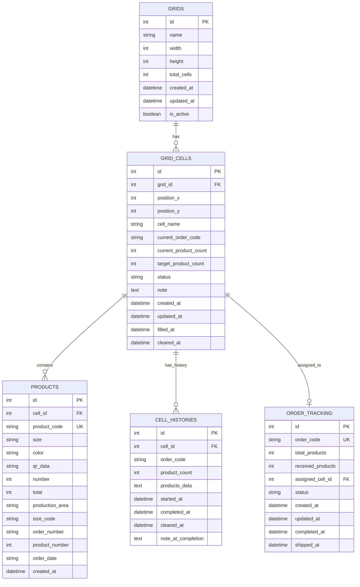

# Database Schema - Grid Management System

## Mermaid ERD Diagram



## Mối quan hệ chi tiết

### 1. GRIDS → GRID_CELLS (1:N)
- Một lưới có nhiều ô
- Khi tạo lưới 3x3 → tự động tạo 9 ô
- Cascade delete: Xóa lưới → xóa tất cả ô

### 2. GRID_CELLS → PRODUCTS (1:N) 
- Một ô chứa nhiều sản phẩm (cùng đơn hàng)
- Mỗi sản phẩm chỉ thuộc 1 ô
- Cascade delete: Xóa ô → xóa tất cả sản phẩm

### 3. GRID_CELLS → CELL_HISTORIES (1:N)
- Một ô có nhiều lịch sử (mỗi lần giao hàng)
- Lưu lại toàn bộ thông tin khi clear ô
- Cascade delete: Xóa ô → xóa tất cả lịch sử

### 4. GRID_CELLS → ORDER_TRACKING (1:1)
- Một ô được gán cho một đơn hàng
- Theo dõi tiến độ hoàn thành đơn hàng
- Nullable: Ô có thể không có đơn hàng

## Luồng dữ liệu chính

### 1. Tạo lưới
```
POST /api/grid/create
{
  "name": "Kho A",
  "width": 3,
  "height": 3
}
→ Tạo 1 GRIDS + 9 GRID_CELLS
```

### 2. Quét sản phẩm
```
POST /api/grid/{grid_id}/assign-product
{
  "productCode": "VA-M-000126-2",
  "size": "L",
  "color": "White", 
  "qrData": "101725-VA-M-000126-2",
  "number": "2",
  "total": "3"
}
→ Kiểm tra trùng lặp PRODUCTS.product_code
→ Tìm ô phù hợp trong GRID_CELLS
→ Tạo PRODUCTS mới
→ Cập nhật GRID_CELLS (count, status)
→ Cập nhật/tạo ORDER_TRACKING
```

### 3. Giao hàng (Clear ô)
```
POST /api/grid/cell/{cell_id}/clear
→ Lấy tất cả PRODUCTS trong ô
→ Tạo CELL_HISTORIES với JSON data
→ Xóa tất cả PRODUCTS
→ Reset GRID_CELLS về empty
→ Cập nhật ORDER_TRACKING thành shipped
```

## Ràng buộc dữ liệu

### Unique Constraints
- `PRODUCTS.product_code` - Không trùng lặp sản phẩm
- `ORDER_TRACKING.order_code` - Không trùng lặp đơn hàng  
- `GRID_CELLS(grid_id, position_x, position_y)` - Không trùng vị trí

### Status Values
- `GRID_CELLS.status`: empty, filling, full
- `ORDER_TRACKING.status`: pending, filling, completed, shipped

### Business Rules
1. Mỗi đơn hàng chỉ được phân bổ vào 1 ô
2. Ô chỉ chứa sản phẩm của 1 đơn hàng
3. Không thể quét trùng product_code
4. Khi ô đầy → status = "full"
5. Khi clear ô → tất cả data chuyển vào history
